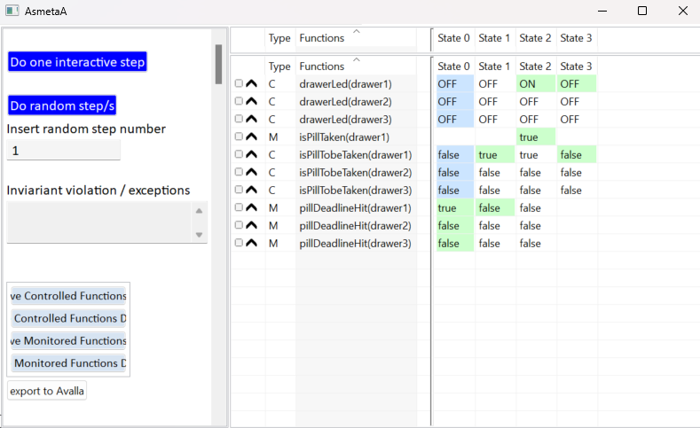

# Artifact guidelines
>[!NOTE]
>
>This document contains the steps to be followed to reproduce the tutorial’s claims.
>
>This contains operative steps, to know more about the theory and the behavior please read the tutorial paper.
>
>Title of the original tutorial paper *"ASMETA tool set for rigorous system design"* submitted at the 26th International Symposium on Formal Methods (FM 2024) - Tutorial track


# Index
* <a href="#SWinstallation">Software Installation</a>
* <a href="#AsmetaS">Model Simulation: AsmetaS</a>
  * <a href="#AsmetaSInt">Interactive Simulation</a>
  * <a href="#AsmetaSRnd">Random Simulation</a>
 * <a href="#AsmetaA">Model Animation: AsmetaA</a>
  * <a href="#AsmetaSInt">Interactive Animation</a>
  * <a href="#AsmetaSRnd">Random Animation</a>
* <a href="#AsmetaV">Scenario-based Validation: AsmetaV</a>
  * <a href="#AsmetaVConsole">Scenario-based Validation</a>
  * <a href="#AsmetaVA">Scenario-based Validation with Animator</a>
* <a href="#AsmetaMA">Model Review: AsmetaMA</a>
* <a href="#AsmetaSMV">Formal Verification Through Model Checking: AsmetaSMV</a>
* <a href="#AsmetatoCode">From an ASMETA Model to Code</a>
  
<a id='SWinstallation'></a>
# Software installation
**Step 1**: Download the .zip file containing the Asmeta tools available [here](https://zenodo.org/records/11955939) depending on your system:

* [eclipse_asmeta_smv_2024_06_win64.zip](https://zenodo.org/records/11955939/files/eclipse_asmeta_smv_2024_06_win64.zip?download=1) 
* [eclipse_asmeta_smv_2024_06_linux_x86_64.zip](https://zenodo.org/records/11955939/files/eclipse_asmeta_smv_2024_06_linux_x86_64.zip?download=1) 
* [eclipse_asmeta_smv_2024_06_macOs_aarch64.zip](https://zenodo.org/records/11955939/files/eclipse_asmeta_smv_2024_06_macOs_aarch64.zip?download=1) 

**Step 2**: Unzip the content.

> **_NOTE:_**  The zip file contains the eclipse with all the necessary plugins, the NuSMV model checker, the workspace with libraries and models for the tutorial, and the scripts to correctly set the environment and launch eclipse with asmeta.

**Step 3**: Run the file in the main folder depending on your OS:

* win64: *asmeta_win64.bat*
* linux_x86_64: *asmeta_linux64.sh*
* macOs_aarch64: *asmeta_macOs_install.sh* and *asmeta_macOs_run.sh*

Eclipse is now running and in the workspace there are two projects:
* *STDL* containing the Asmeta libraries
* *tutorial_FM24* containing the Asmeta models of the Pill-Box Case Study

**Step 4**: set the NuSMV path only for Linux and macOS:

in "Window -> Preferences -> Asmeta -> AsmetaSMV -> NuSMV executable program" select the path to the NuSMV executable file

* linux_x86_64: "eclipse_asmeta_smv_2024_06_linux_x86_64\asmeta_linux_x86_64\NuSMV-2.6.0-Linux\bin\NuSMV"
* macOs_aarch64: "eclipse_asmeta_smv_2024_06_macOs_aarch64\macOs_aarch64\NuSMV-2.6.0-Darwin\bin\NuSMV" 

For other platforms, instead, we provide an update site that can be used to install all the required plugins in any Eclipse version. Then the projects *STDL* and *tutorial_FM24* can be downloaded from [here](https://github.com/asmeta/asmeta/tree/master/asmeta_models) and imported into Eclipse.


In the following, we will explain the steps to use the Asmeta tools on the *pillbox_ground.asm* model, the same steps can be followed for the other models.

>[!NOTE]
> Java is mandatory to run this tutorial. If it is not installed on your PC you can download it [here](https://www.oracle.com/it/java/technologies/downloads/).


<a id='AsmetaS'></a>
# Model Simulation: AsmetaS

<a id='AsmetaSInt'></a>
### Interactive Simulation

**Step 1**: Uncheck the following two options in "Window -> Preferences -> Asmeta -> Simulator":

* Stop simulation if the update set is empty
* Stop simulation if the update set is trivial

**Step 2**: Open the *pillbox_ground.asm* model in the Eclipse editor.

**Step 3**: Run the specification iteratively in the console using  button.

Let's assume that we want to simulate the scenario in Fig. 5 of the paper: *the pill in drawer 1 hits the deadline (in State 0), so the pill becomes to be taken (State 1), the led becomes ON (State 2), the user takes the pill, and the led becomes OFF (State 3)*.
In the following are listed the current state, the **inputs to be set** in the console, and the updated functions.

**Step 4**:  State 0

  Current state:
  * drawerLed(drawer1) = OFF
  * drawerLed(drawer2) = OFF
  * drawerLed(drawer3) = OFF
  * isPillTobeTaken(drawer1) = true
  * isPillTobeTaken(drawer2) = false
  * isPillTobeTaken(drawer3) = false

  Inputs (monitored functions) to be set in the console (the order may change):
  * pillDeadlineHit(drawer1) = true
  * pillDeadlineHit(drawer2) = false
  * pillDeadlineHit(drawer3) = false
 
  Update set:
  * isPillTobeTaken(drawer1)=true
 
 **Step 5**: State 1

   Current state:
   * drawerLed(drawer1) = OFF
   * drawerLed(drawer2) = OFF
   * drawerLed(drawer3) = OFF
   * isPillTobeTaken(drawer1) = true
   * isPillTobeTaken(drawer2) = false
   * isPillTobeTaken(drawer3) = false
    
   Inputs (monitored functions) to be set in the console (the order may change):
   * pillDeadlineHit(drawer1) = false
   * pillDeadlineHit(drawer2) = false
   * pillDeadlineHit(drawer3) = false
 
   Update set:
   * drawerLed(drawer1) = ON

**Step 6**: State 2

  Current state:
  * drawerLed(drawer1) = ON
  * drawerLed(drawer2) = OFF
  * drawerLed(drawer3) = OFF
  * isPillTobeTaken(drawer1) = true
  * isPillTobeTaken(drawer2) = false
  * isPillTobeTaken(drawer3) = false
     
  Inputs (monitored functions) to be set in the console (the order may change)::
  * pillDeadlineHit(drawer1) = false
  * pillDeadlineHit(drawer2) = false
  * pillDeadlineHit(drawer3) = false
  * isPillTaken(drawer1) = true

  Update set:
   * isPillTobeTaken(drawer1) = false
   * drawerLed(drawer1) = OFF

 **Step 7**: State 3
   
   Current state:
   * drawerLed(drawer1)=OFF
   * drawerLed(drawer2)=OFF
   * drawerLed(drawer3)=OFF
   * isPillTobeTaken(drawer1)=false
   * isPillTobeTaken(drawer2)=false
   * isPillTobeTaken(drawer3)=false
  
To simulate other scenarios use different inputs.

<a id='AsmetaSRnd'></a>
### Random Simulation

**Step 1**: Open the *pillbox_ground.asm* model in the Eclipse editor.

**Step 2**: Run the specification randomly in the console using  button.

The inputs are randomly chosen, and the simulation is displayed in the console.

<a id='AsmetaA'></a>
# Model Animation: AsmetaA

<a id='AsmetaAInt'></a>
### Interactive Animation

**Step 1**: Open the *pillbox_ground.asm* model in the Eclipse editor.

**Step 2**: Run the specification using the animator by pressing the  button.

Let's assume that we want to animate the scenario in Fig. 6 of the paper (which is the same as the simulation): *the pill in drawer 1 hits the deadline (in State 0), so the pill becomes to be taken (State 1), the led becomes ON (State 2), the user takes the pill, and the led becomes OFF (State 3)*.
In the following are listed the **inputs to be set** in the windows that appear to acquire inputs.

**Step 3**: State 0

  Current state:
  * drawerLed(drawer1) = OFF
  * drawerLed(drawer2) = OFF
  * drawerLed(drawer3) = OFF
  * isPillTobeTaken(drawer1) = true
  * isPillTobeTaken(drawer2) = false
  * isPillTobeTaken(drawer3) = false
  
  Press  *"Do one interactive step"* button in the animator and set the following inputs:
  * pillDeadlineHit(drawer1) = true
  * pillDeadlineHit(drawer2) = false
  * pillDeadlineHit(drawer3) = false

**Step 4**: State 1

 Current state:
   * drawerLed(drawer1) = OFF
   * drawerLed(drawer2) = OFF
   * drawerLed(drawer3) = OFF
   * isPillTobeTaken(drawer1) = true
   * isPillTobeTaken(drawer2) = false
   * isPillTobeTaken(drawer3) = false
    
   Press  *"Do one interactive step"* button in the animator and set the following inputs:
   * pillDeadlineHit(drawer1) = false
   * pillDeadlineHit(drawer2) = false
   * pillDeadlineHit(drawer3) = false

 **Step 5**: State 2

   Current state:
  * drawerLed(drawer1) = ON
  * drawerLed(drawer2) = OFF
  * drawerLed(drawer3) = OFF
  * isPillTobeTaken(drawer1) = true
  * isPillTobeTaken(drawer2) = false
  * isPillTobeTaken(drawer3) = false
     
  Press  *"Do one interactive step"* button in the animator and set the following inputs:
  * pillDeadlineHit(drawer1) = false
  * pillDeadlineHit(drawer2) = false
  * pillDeadlineHit(drawer3) = false
  * isPillTaken(drawer1) = true

**Step 6**: State 3
   
   Current state:
   * drawerLed(drawer1)=OFF
   * drawerLed(drawer2)=OFF
   * drawerLed(drawer3)=OFF
   * isPillTobeTaken(drawer1)=false
   * isPillTobeTaken(drawer2)=false
   * isPillTobeTaken(drawer3)=false

After following these steps, this is the output in the animator, where light-blue background means that it is the initial value of functions, and green background means that the function value has changed:

 
 
To animate other scenarios use different inputs.

<a id='AsmetaARnd'></a>
### Random Animation

**Step 1**: Open the *pillbox_ground.asm* model in the Eclipse editor.

**Step 2**: Run the specification using the animator by pressing the  button.

**Step 3**: Press  *"Do random step/s"* button in the animator. The specification is executed with a random set of inputs.

The specification can be animated randomly step by step or more steps can be automatically randomly executed by setting the number of steps in the text box under the inscription *Insert random step number*.

<a id='AsmetaV'></a>
# Scenario-based Validation: AsmetaV

Let's assume that we want to validate the model using the scenario in Listing 2 of the paper: 

*Initially, the Pill-Box has all the LEDs OFF, so no pill has to be taken. In the second step, we set the deadline for the pill in the first drawer as hit and, after the execution of a step, the scenario checks whether the pill has been marked as one of those to be taken. Then, after a new
execution step, we check that the LED corresponding to the first drawer is ON.
Finally, after the patient has taken the pill, the scenario verifies whether all the LEDs have been turned OFF.*

<a id='AsmetaVConsole'></a>
### Scenario-based Validation 

**Step 1**: Open the *scenario_ground.avalla* in the Eclipse editor.

**Step 2**: Run the scenario-based validation by pressing the  button.
The output of the scenario execution is displayed in the console, and all checks are passed: *"Validation terminated without errors"*.

If a check violation occurs, it finishes with *"WARNING: some check failed"*. To test this change line 46 in the *scenario_ground.avalla* file by replacing *OFF* with *ON*.

<a id='AsmetaVA'></a>
### Scenario-based Validation with Animator

**Step 1**: Open the *scenario_ground.avalla* in the Eclipse editor.

**Step 2**: Run the scenario-based validation by pressing the  button.
The output of the scenario execution is displayed in the animator.

**Step 3**: Press *"Do one interactive step"* button to run the scenario step by step.
Press *"Do random step/s"* button and set the number of steps in the text box under the inscription *Insert random step number* to run automatically more than one step.

<a id='AsmetaMA'></a>
# Model review: AsmetaMA

**Step 1**: Open the *pillbox_ground.asm* model in the Eclipse editor.

**Step 2**: Run the model review by pressing the  button.
The output is displayed in the console.

<a id='AsmetaSMV'></a>
# Formal Verification Through Model Checking: AsmetaSMV

**Step 1**: Open the *pillbox_ground.asm* model in the Eclipse editor.

**Step 2**: Run the model checker by pressing the  button. 
All the properties are true.

If a property is false, a counter-example is shown. To test this remove *"not"* from line 81. When running the model checker a counter-example is shown.

<a id='AsmetatoCode'></a>
# From an ASMETA Model to Code

**Step 1**: Download the .zip file [eclipse_asmeta_smv_2024_06_cli.zip](https://zenodo.org/records/11955939/files/eclipse_asmeta_smv_2024_06_cli.zip?download=1).

**Step 2**: Unzip the content.

**Step 3**: Copy the *Asmeta2Cpp.jar* file in the same folder where the *"pillbox_final.asm"* is.

**Step 3**: Run the command   
```
java -jar Asmeta2Cpp.jar pillbox_final.asm
```
The *pillbox_final.h* and *pillbox_final.cpp* files are generated.


