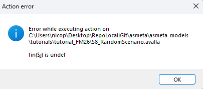
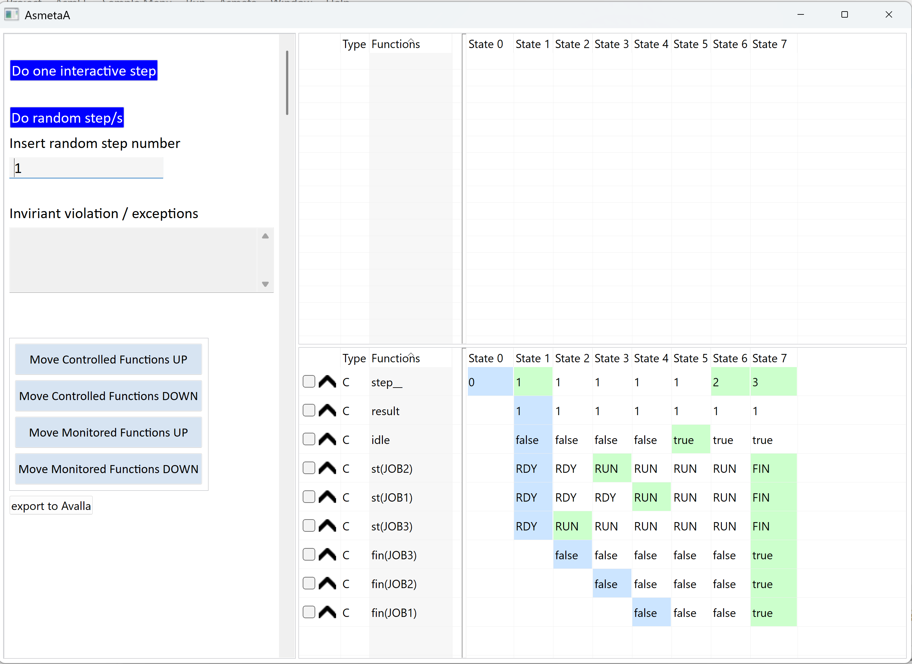
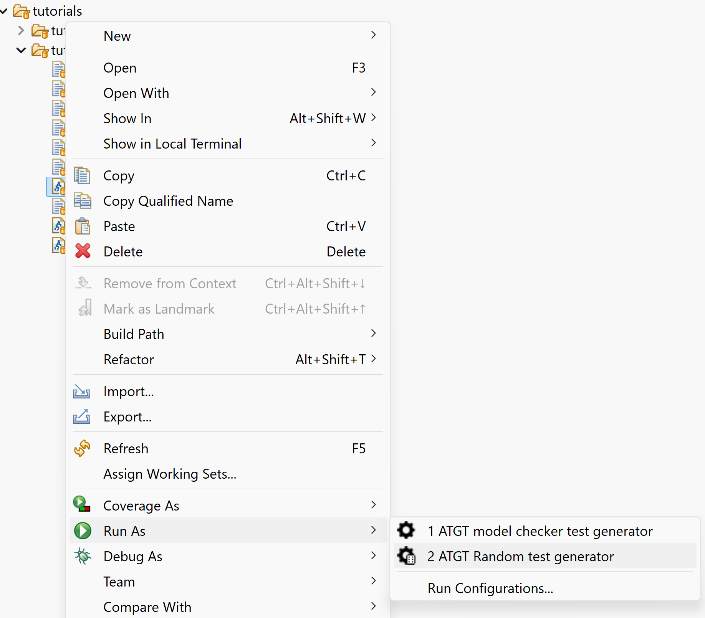

# Artifact Guidelines

> **NOTE**
> This document contains the steps to be followed to reproduce the tutorial’s claims.
> This contains operative steps. To know more about the theory and the behavior, please read the tutorial paper.
>
> Title of the original tutorial paper:
> **"Scenario-Based Model Validation in Asmeta"**
> submitted at the 27th International Symposium on Formal Methods (FM 2026) - Tutorial track.

---

## Index

* [Software Installation](#software-installation)
  * [Windows](#windows)
  * [Linux and macOS](#linux-and-macos)
* [Scenario-based Validation](#scenario-based-validation)
  * [Scenario Animation](#scenario-animation)
  * [Validation with Coverage](#validation-with-coverage)
  * [Scenario Generation](#scenario-generation)

---

# Software Installation

This section describes how to install and configure the ASMETA toolset included in this replication package.

> **NOTE**
> Java is mandatory to run this tutorial. Please install Java (JDK >= 21 recommended) if not already available.

## Windows

### Step 1
Download the `.zip` file containing the Asmeta tool included in the replication package:

- `eclipse_asmeta_smv_2026_02_win64.zip`

### Step 2
Unzip the content.

**NOTE:**  
The zip file contains Eclipse with all necessary plugins, the workspace with libraries and models for the tutorial, and the script to correctly set the environment and launch Eclipse with Asmeta.

### Step 3
Run the `asmeta_win64.bat` file in the main folder.

Eclipse is now running and in the workspace there are two projects:

- `STDL` containing the Asmeta libraries
- `tutorial_FM26` containing the Asmeta models and Avalla scenarios of the Scheduler Running Example

The environment is now ready for use.

## Linux and macOS
For Linux and macOS, use the multiplatform version (2024_06) available in the `older version multiplatform` section of the README in the [Asmeta GitHub Repository](https://github.com/asmeta/asmeta/).

You can follow **Step 1** and **Step 2** as described for Windows (download and unzip the archive).

### Step 3
Run the file in the main folder depending on your OS:

* Linux: `asmeta_linux64.sh`
* macOs: `asmeta_macOs_install.sh` and `asmeta_macOs_run.sh`

Eclipse is now running and in the workspace there are two projects:

- `STDL` containing the Asmeta libraries
- `tutorial_FM24` containing the Asmeta models of the Pillbox Case Study used in the ["ASMETA tool set for rigorous system design"](https://link.springer.com/chapter/10.1007/978-3-031-71177-0_28) tutorial paper.

For the purposes of this replication package:

- You can safely delete `tutorial_FM24`.
- Import into Eclipse the `tutorial_FM26` project, available in this replication Package. 

Alternatively, the `tutorial_FM26` project can be downloaded from the Asmeta repository (under [asmeta_models](https://github.com/asmeta/asmeta/tree/master/asmeta_models)) and imported into Eclipse.

### Step 4

To ensure compatibility with the replication package, update ASMETA to the latest version:

* `Help -> Intall New Software...`
* In the `Work with` field, select `Asmeta - https://raw.githubusercontent.com/asmeta/asmeta_update_site/master`
* Select all entries and proceed with the installacion clicking on `Next`

Ignore the warning `Will be uninstalled: Asmeta: Abstract State Machine Franework`.

After completing the update, restart Eclipse.

---

# Scenario-based Validation

1. Open the `S1_BasicStart.avalla` in the Eclipse editor.
2. Run the scenario-based validation by pressing the  button.

The output of the scenario execution is displayed in the console, and all checks are passed: `Validation terminated without errors`.

To test a failure, run validation for `S2_Failure.avalla`. The output of the scenario execution is displayed in the console: 
```
CHECK FAILED: st(JOB1) = RUN or st(JOB2) = RUN or st(JOB3) = RUN at step 1
[...]
WARNING: validation incomplete - some checks failed or errors occurred
```


To test an invariant violation, run validation for `S3_InvariantViolation.avalla`. The console will report an invariant violation in addition to the `WARNING` message: `invariant violation found`.

You can also run valiadtion for the scenarios with prefix from `S4_` to `S7_`.

`S8_RandomScenario.avalla` was obtained via random generation (see below). Therefore, since `Scheduler.asm` contains a `choose` rule, the validation can either complete successfully or result in an Action Error:



`SchedulerBlocks.avalla` can be validated and the output will indicate success. However, since it only defines blocks, it is not concretely executed.

## Scenario Animation

1. Open the `S5_UsingBlocks.avalla` in the Eclipse editor.
2. Run the scenario animation by pressing the  button. The output of the scenario execution is displayed in the animator window.
3. Press `Do one interactive step` button to run the scenario step by step.
Press `Do random step/s` button and set the number of steps in the text box under the inscription `Insert random step number` to run automatically more than one step.



Eventual invariant violation (e.g., from `S3_InvariantViolation.avalla`) and errors (e.g., from `S8_RandomScenario.avalla`) will appear in the `Invariant violation / exceptions` box.

You can run scenario animation for all the scenarios with prefix from `S1_` to `S8_`.

## Validation with Coverage

1. Open the `S1_BasicStart.avalla` in the Eclipse editor.
2. Run the scenario-based validation with coverage computation by pressing the  button.

The output of the scenario execution is displayed in the console. Before the standard success message that indicate that all checks are passed: `Validation terminated without errors`, a structured presentation of coverage data is printed:
```
** Coverage Info: **
** covered rules: **
Scheduler::r_SetFinished()
-> branch coverage:        25.00%
-> rule coverage:          33.33%
-> update rule coverage:    0.00%
-> forall rule coverage:   33.33%
Scheduler::r_Main()
-> branch coverage:       - (no branches to be covered)
-> rule coverage:         100.00%
-> update rule coverage:  - (no update rules to be covered)
-> forall rule coverage:  - (no forall rules to be covered)
Scheduler::r_SetRunning()
-> branch coverage:        50.00%
-> rule coverage:          66.67%
-> update rule coverage:   50.00%
-> forall rule coverage:  - (no forall rules to be covered)
** NOT covered rules: **

```

You can run valiadtion with coverage for all the scenarios with prefix from `S1_` to `S8_`.

## Scenario Generation

### From Animator
1. Open the `Scheduler.asm` in the Eclipse editor.
2. Run model animation by pressing the  button. The output of the animation execution is displayed in the animator window.
3. Press `Do one interactive step` button to run an interactive by step, or press `Do random step/s` button and set the number of steps in the text box under the inscription `Insert random step number` to run more than one step with random input.
4. After running some steps, press `export to Avalla` button save the execution as an Avalla Scenario.

The resulting scenario is diplayed on the console and it can be copy/pasted in a new `.avalla` scenario.

### Using ATGT random exploration

1. Right click on the `Scheduler.asm` in the Package Explorer window of the Eclipse editor.
2. Select `Run as...` -> `2 ATGT Random test generator`.



The resulting set of scenarios is generated in the `abstracttests` folder.
