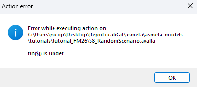
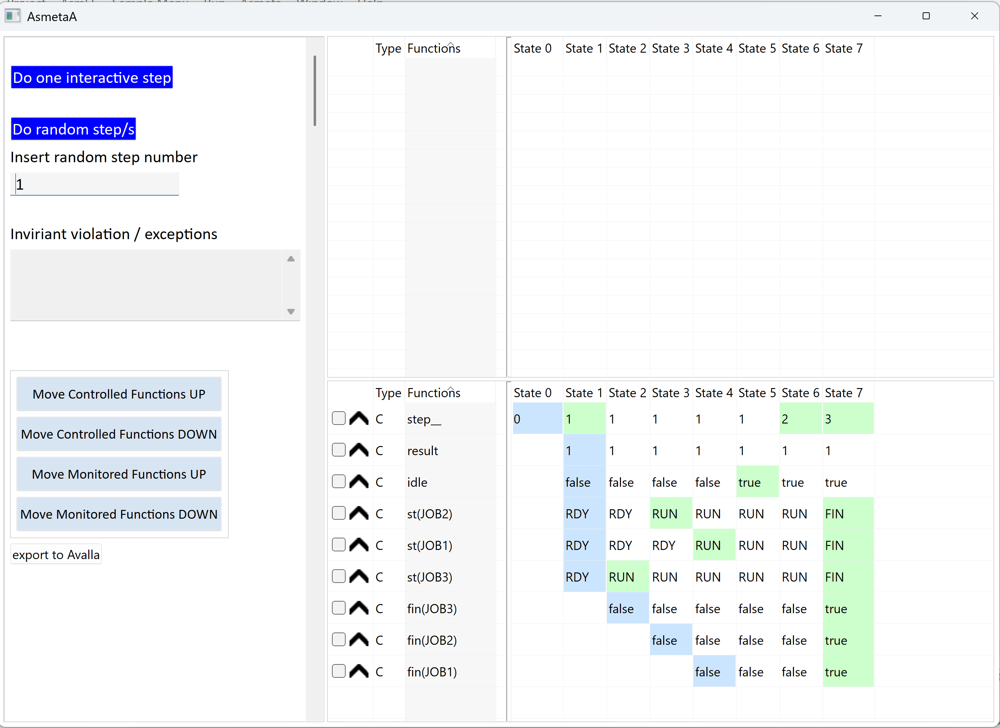
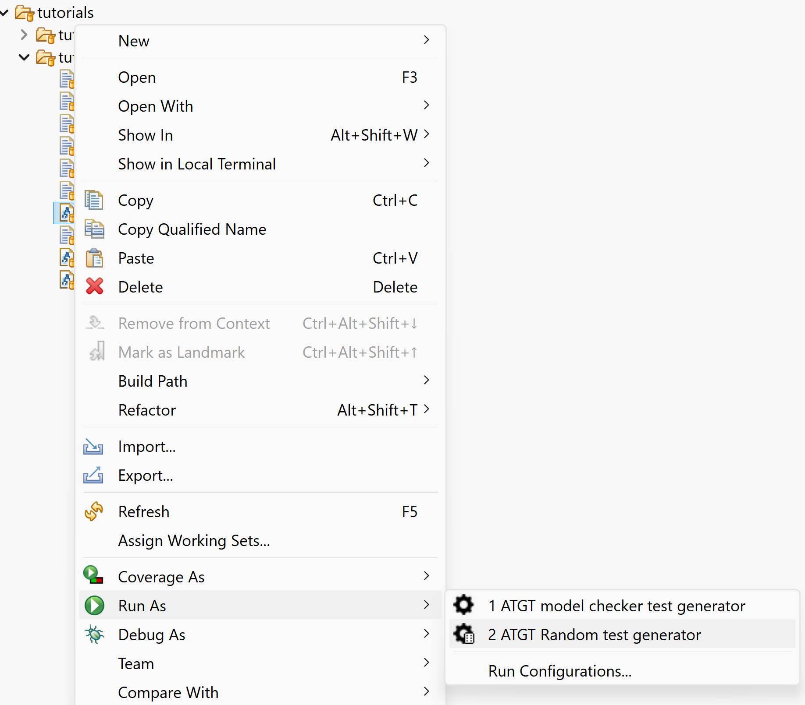

# Artifact Guidelines


This document contains the steps to be followed to reproduce the tutorial’s claims.
This contains operative steps. To know more about the theory and the behavior, please read the tutorial paper.

Title of the original tutorial paper:
**"Scenario-Based Model Validation in Asmeta"**
submitted at the 27th International Symposium on Formal Methods (FM 2026) - Tutorial track.

---

## Index

* [Running via Docker](#running-via-docker)
* [Software Installation](#software-installation)
  * [Windows](#windows)
  * [Linux and macOS](#linux-and-macos)
* [Scenario-based Validation](#scenario-based-validation)
  * [Scenario Animation](#scenario-animation)
  * [Validation with Coverage](#validation-with-coverage)
  * [Scenario Generation](#scenario-generation)
* [Appendix: Installing Java](#appendix-installing-java)

---

# Running via Docker

This section describes how to run the Docker container included in the replication package. If you prefer installing Asmeta locally on your machine, please refer to the [Software Installation](#software-installation) section.

> **NOTE**
> The provided Docker image is built for **linux/amd64 architectures**.
> It may not run natively on macOS with Apple Silicon (M1/M2/M3) unless Docker emulation for amd64 images is enabled.

---

Prerequisites:
- A CPU supporting linux/amd64 architecture
- Docker installed on your system (https://docs.docker.com/get-docker/)

You can verify Docker installation with:

`docker --version`

---

### Step 1

Download the `.tar.gz` file included in the replication package:
- `asmeta-validation-tutorial.tar.gz`

Load the Docker image (this may take a few minutes):
```
docker load -i asmeta-validation-tutorial.tar.gz
```

### Step 2

Run the Docker container with:

```
docker run -p 6080:6080 asmeta-validation-tutorial:v0.0.1
```

You can customize the **scale** and **resolution** using the `GDK_SCALE` and `VNC_GEOMETRY` environment variables. For example:

```
docker run -p 6080:6080 -e GDK_SCALE=3 -e VNC_GEOMETRY=3840x2400 asmeta-validation-tutorial:v0.0.1
```

### Step 3

1. Open your browser and navigate to: `http://localhost:6080/vnc.html?resize=scale`
2. Connect to noVNC using the password: `asmeta`
3. Once connected, the Asmeta environment will start automatically and a `README.pdf` file will be opened inside the container

You can follow the tutorial steps using the opened `README.pdf` or by following the instructions provided in the [Scenario-based Validation](scenario-based-validation) section.

**Note**: In case the session is locked or in standby mode, use the password: `asmeta`

---

### Stopping and Removing the Container

To stop the container, list running containers and copy the CONTAINER ID (or the auto-generated name):
```
docker ps
docker stop <CONTAINER_ID_OR_NAME>
```
To remove it:
```
docker rm <CONTAINER_ID_OR_NAME>
```

---
---

**For frequent usage of Asmeta, a local installation is recommended as described in the next section.**

# Software Installation

This section describes how to install and configure the Asmeta toolset included in this replication package.

> **NOTE**
> Java is mandatory to run this tutorial. Please install Java (JDK >= 21 recommended) if not already available. You can follow the instruction in the [Appendix](#appendix-installing-java) at the end of this document.

## Windows

### Step 1
Download the `.zip` file containing the Asmeta tool included in the replication package:

- `eclipse_asmeta_smv_2026_02_win64.zip`

### Step 2
Unzip the content.

**NOTE:**  
The zip file contains Eclipse with all necessary plugins, the workspace with libraries and models for the tutorial, and the script to correctly set the environment and launch Eclipse with Asmeta.

### Step 3
Run the `asmeta_win64.bat` file in the main folder.

Eclipse is now running and in the workspace there are two projects:

- `STDL` containing the Asmeta libraries
- `tutorial_FM26` containing the Asmeta models and Avalla scenarios of the Scheduler Running Example

The environment is now ready for use.

## Linux and macOS
For Linux and macOS, use the multiplatform version (2024_06) available in the `older version multiplatform` section of the README in the [Asmeta GitHub Repository](https://github.com/asmeta/asmeta/).

You can follow **Step 1** and **Step 2** as described for Windows (download and unzip the archive).

### Step 3
Run the file in the main folder depending on your OS:

* Linux: `asmeta_linux64.sh`
* macOs: `asmeta_macOs_install.sh` and `asmeta_macOs_run.sh`

Eclipse is now running and in the workspace there are two projects:

- `STDL` containing the Asmeta libraries
- `tutorial_FM24` containing the Asmeta models of the Pillbox Case Study used in the ["ASMETA tool set for rigorous system design"](https://link.springer.com/chapter/10.1007/978-3-031-71177-0_28) tutorial paper.

For the purposes of this replication package:

- You can safely delete `tutorial_FM24`.
- Import into Eclipse the `tutorial_FM26` project, available in this replication Package. 

Alternatively, the `tutorial_FM26` project can be downloaded from the Asmeta repository (under [asmeta_models](https://github.com/asmeta/asmeta/tree/master/asmeta_models)) and imported into Eclipse.

### Step 4

To ensure compatibility with the replication package, update ASMETA to the latest version:

* `Help -> Intall New Software...`
* In the `Work with` field, select `Asmeta - https://raw.githubusercontent.com/asmeta/asmeta_update_site/master`
* Select all entries and proceed with the installacion clicking on `Next`

Ignore the warning `Will be uninstalled: Asmeta: Abstract State Machine Franework`.

After completing the update, restart Eclipse.

---

# Scenario-based Validation
Once Asmeta is correctly running, either the local installaion or within the Docker container, the basics of scenario-based validation on Asmeta can be replicated as follows:

1. Open the `S1_BasicStart.avalla` in the Eclipse editor.
2. Run the scenario-based validation by pressing the  button.

The output of the scenario execution is displayed in the console, and all checks are passed: `Validation terminated without errors`.

To test a failure, run validation for `S2_Failure.avalla`. The output of the scenario execution is displayed in the console: 
```
CHECK FAILED: st(JOB1) = RUN or st(JOB2) = RUN or st(JOB3) = RUN at step 1
[...]
WARNING: validation incomplete - some checks failed or errors occurred
```


To test an invariant violation, run validation for `S3_InvariantViolation.avalla`. The console will report an invariant violation in addition to the `WARNING` message: `invariant violation found`.

You can also run validation for the scenarios with prefix from `S4_` to `S7_`.

`S8_RandomScenario.avalla` was obtained via random generation (see below). Therefore, since `Scheduler.asm` contains a `choose` rule, the validation can either complete successfully or result in an Action Error:



`SchedulerBlocks.avalla` can be validated and the output will indicate success. However, since it only defines blocks, it is not concretely executed.

## Scenario Animation

1. Open the `S5_UsingBlocks.avalla` in the Eclipse editor.
2. Run the scenario animation by pressing the  button. The output of the scenario execution is displayed in the animator window.
3. Press `Do one interactive step` button to run the scenario step by step.
Press `Do random step/s` button and set the number of steps in the text box under the inscription `Insert random step number` to run automatically more than one step.



Eventual invariant violation (e.g., from `S3_InvariantViolation.avalla`) and errors (e.g., from `S8_RandomScenario.avalla`) will appear in the `Invariant violation / exceptions` box.

You can run scenario animation for all the scenarios with prefix from `S1_` to `S8_`.

## Validation with Coverage

1. Open the `S1_BasicStart.avalla` in the Eclipse editor.
2. Run the scenario-based validation with coverage computation by pressing the  button.

The output of the scenario execution is displayed in the console. Before the standard success message that indicate that all checks are passed: `Validation terminated without errors`, a structured presentation of coverage data is printed:
```
** Coverage Info: **
** covered rules: **
Scheduler::r_SetFinished()
-> branch coverage:        25.00%
-> rule coverage:          33.33%
-> update rule coverage:    0.00%
-> forall rule coverage:   33.33%
Scheduler::r_Main()
-> branch coverage:       - (no branches to be covered)
-> rule coverage:         100.00%
-> update rule coverage:  - (no update rules to be covered)
-> forall rule coverage:  - (no forall rules to be covered)
Scheduler::r_SetRunning()
-> branch coverage:        50.00%
-> rule coverage:          66.67%
-> update rule coverage:   50.00%
-> forall rule coverage:  - (no forall rules to be covered)
** NOT covered rules: **

```

You can run valiadtion with coverage for all the scenarios with prefix from `S1_` to `S8_`.

## Scenario Generation

### From Animator
1. Open the `Scheduler.asm` in the Eclipse editor.
2. Run model animation by pressing the  button. The output of the animation execution is displayed in the animator window.
3. Press `Do one interactive step` button to run an interactive by step, or press `Do random step/s` button and set the number of steps in the text box under the inscription `Insert random step number` to run more than one step with random input.
4. After running some steps, press `export to Avalla` button save the execution as an Avalla Scenario.

The resulting scenario is diplayed on the console and it can be copy/pasted in a new `.avalla` scenario.

### Using ATGT random exploration

1. Right click on the `Scheduler.asm` in the Package Explorer window of the Eclipse editor.
2. Select `Run as...` -> `2 ATGT Random test generator`.



The resulting set of scenarios is generated in the `abstracttests` folder.

---

# Appendix: Installing Java

## Windows
To quickly install Java on Windows, follow these three steps:

1. **Download the Installer**: download the latest JDK (Java Development Kit) installer (MSI or .exe) from the [Oracle website](https://www.oracle.com/java/technologies/downloads/#jdk25-windows).
2. **Run the installer**: Double-click the downloaded .msi or .exe file to start the installation wizard. follow the on-screen prompts, and click "Close" when finished.
3. **Verify the installation (optional)**:  Open Command Prompt (search for  `cmd`  in the Start menu) and type  `java -version` to confirm that the installation was successful
 
## MacOS
To quickly install Java on Mac, follow these three steps:

1. **Download the Installer**: Visit the official [Oracle website](https://www.oracle.com/java/technologies/downloads/#jdk25-mac) and download the latest JDK (Java Development Kit) DMG installer. 
   Choose the version based on your processor:
    * ARM64 DMG Installer: For Mac with Apple Silicon (M1/M2/M3 chips).
    * x64 DMG Installer: For Intel-based Macs.
2. **Run the Installer**: Open the downloaded .dmg file and double-click the .pkg file to launch the installation wizard. Follow the on-screen instructions, click `Install`, and enter your Mac's password to grant permission.
3. **Verify Installation (optional)**: Open the Terminal (via Spotlight search), type `java -version`, and press Enter to confirm the installation. 

## Linux - Ubuntu

To quickly install Java on Ubuntu, follow these three steps:

1. First verify that Java is not already inststalled
2. Install the default JRE with `apt`
3. Run `java --version` on the command line to validate the install

### 1. Check for existing Java installs

You don’t need to setup Java on Ubuntu if someone has already installed it for you. A quick `java --version` check will tell you if an install is necessary. 
Open a terminal and check if java is not installed, by trying to execute `java`:
```
java -version
Command 'java' not found, but can be installed with:
sudo apt install default-jre
```
If instaed, the command indicates the version, then Java is installed and you are done. Otherwise you have to install java by usign the apt commands

### 2. Install Java on ubuntu with apt

The full Java suite includes the Java Runtime Environment (JRE), Java Virtual Machine (JVM) and utilities to develop Java source code.
The Java Development Kit (JDK) provides everything a user needs to run Java applications. Install the JDK with the following command:
```
sudo apt install default-jre
Setting up default-jdk-headless (2:1.21) ... 
Setting up openjdk-21-jdk:amd64 (21.0.5+11-1ubuntu~24.04.1) ... 
using /usr/lib/jvm/java-11-openjdk-amd64/bin/jconsole 
Setting up default-jdk (2:1.21) ...
```
Note that it may necessary to execute sudo `apt-get update`
### 3. Verify Java is on the PATH

To validate the successful install of Java on Ubuntu, and to ensure the JDK’s bin directory is accessible through the OS’s PATH variable, issue the following command:
```
java -version
openjdk version "21.0.5" 2024-10-15
OpenJDK Runtime Environment (21.0.5+11-1ubuntu~24.04.11)
OpenJDK 64-Bit Server VM (21.0.5+11-1ubuntu~24.04.1, mixed mode, sharing)
```

If the `java -version` command outputs information about the version of Java installed, along with information about the JVM and runtime environment, then you successfully installed Java on Ubuntu with apt.

---